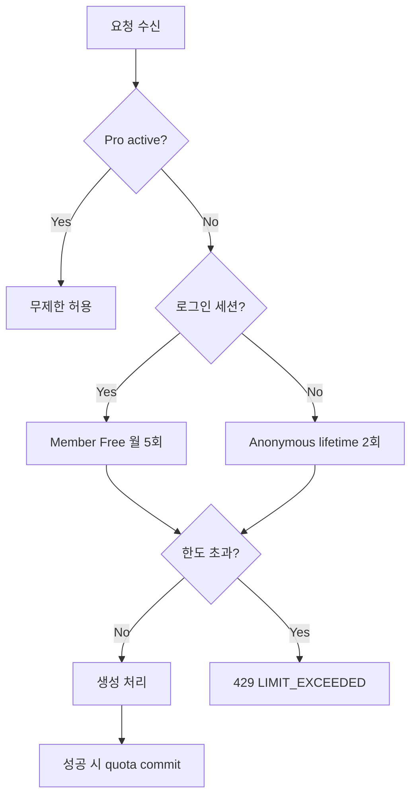
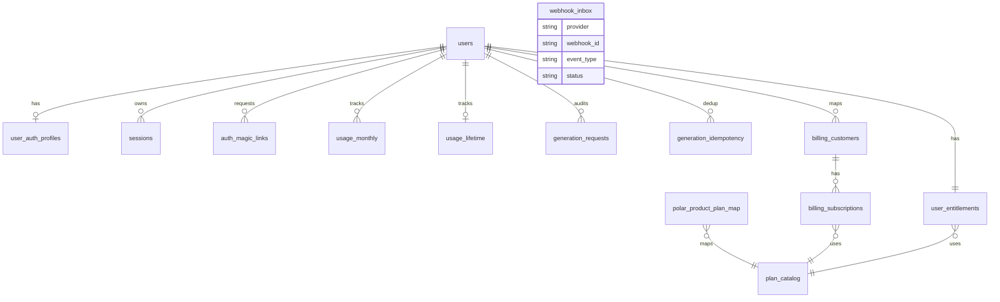

# ASO-Copilot

> 이 문서는 `scripts/update-readme.mjs`로 자동 생성됩니다.  
> 변경 사항 반영 후 `pnpm readme:update`로 재생성하세요.

ASO-Copilot은 앱스토어 스크린샷 카피를 분석해 전환 관점의 개선안을 제안하는 Revenue 중심 AI SaaS입니다.

- 프론트엔드: Next.js (Cloudflare Pages)
- API: Hono + Cloudflare Workers
- DB: Cloudflare D1 (SQLite)
- 결제: Polar (Webhook 기반 Entitlement 반영)
- 모노레포: pnpm workspace

---

## 1. 제품 개요 (Product Overview)

ASO-Copilot은 다음 결과를 생성합니다.

1. Conversion Score
2. 카테고리 기준 Benchmark 비교
3. 개선 Recommendation
4. A/B/C 카피 Variants
5. Export-ready 결과

핵심 목표는 사용자가 "현재 카피가 어느 수준인지"를 빠르게 파악하고, 즉시 실험 가능한 대안을 얻도록 만드는 것입니다.

---

## 2. 비즈니스 모델 및 매출 로직 (Business Model & Revenue Logic)

현재 코드베이스는 **v1 + v2 정책 공존 구조**입니다.

- **v2 (권장/운영 목표)**: `USAGE_POLICY_V2_ENABLED=true`
  - Anonymous: lifetime 2회
  - Member(로그인 Free): 월 5회
  - Pro: 무제한
  - `x-request-id` 필수 + idempotency + postsuccess 차감
- **v1 (호환 모드)**: `USAGE_POLICY_V2_ENABLED=false`
  - Free 기본 월 3회 중심의 기존 흐름 유지

Entitlement 판단 우선순위:

1. `user_entitlements`의 `plan_code=pro AND status=active`면 무제한
2. 아니면 인증 상태(세션) 기준으로 free/member 판단
3. 비인증은 anonymous 제한 적용

---

## 3. 시스템 아키텍처 (System Architecture)

```mermaid
flowchart LR
  U[브라우저/클라이언트] --> W[Next.js on Cloudflare Pages]
  W -->|HTTPS| A[Hono API on Cloudflare Workers]
  A --> D[(Cloudflare D1)]
  A --> O[OpenAI API]
  P[Polar Checkout] -->|Webhook| A

  subgraph API 내부
    M1[uid-cookie middleware]
    M2[session-cookie middleware]
    M3[request-id middleware]
    G[/generate]
    E[/v1/entitlements]
    AU[/auth/*]
    ME[/api/me]
    WH[/webhooks/polar]
  end

  A --> M1 --> M2 --> M3 --> G
  A --> E
  A --> AU
  A --> ME
  A --> WH
```

아키텍처 원칙:

- API는 상태 비저장(stateless)으로 수평 확장 가능해야 함
- 요금/권한은 항상 서버 단에서 판정
- 결제 이벤트는 Webhook Inbox로 중복 방지 처리

---

## 4. API 레퍼런스 (API Reference)

### 4.1 핵심 엔드포인트

| Method | Path | 설명 |
| --- | --- | --- |
| GET | `/health` | 헬스체크 |
| POST | `/generate` | 카피 분석/생성 |
| GET | `/v1/entitlements` | 현재 uid/plan/usage 조회 |
| POST | `/webhooks/polar` | Polar 이벤트 수신 |
| POST | `/auth/request-magic-link` | 매직링크 발송 요청 |
| GET | `/auth/verify` | 매직링크 검증 및 세션 생성 |
| POST | `/auth/logout` | 로그아웃 |
| GET | `/api/me` | 인증/플랜/사용량 정보 |

### 4.2 감지된 라우트 목록(코드 스캔 기반)

| Method | Path | Source |
| --- | --- | --- |
| GET | `/api/admin/analytics` | `apps/api/src/routes/admin.analytics.ts` |
| GET | `/api/me` | `apps/api/src/routes/me.ts` |
| GET | `/auth/verify` | `apps/api/src/routes/auth.ts` |
| GET | `/v1/entitlements` | `apps/api/src/routes/entitlements.ts` |
| GET | `isAuthenticated` | `apps/api/src/routes/generate.ts` |
| GET | `isAuthenticated` | `apps/api/src/routes/me.ts` |
| GET | `requestId` | `apps/api/src/routes/generate.ts` |
| GET | `sessionUid` | `apps/api/src/routes/generate.ts` |
| GET | `sessionUid` | `apps/api/src/routes/me.ts` |
| GET | `uid` | `apps/api/src/routes/auth.ts` |
| GET | `uid` | `apps/api/src/routes/entitlements.ts` |
| GET | `uid` | `apps/api/src/routes/generate.ts` |
| GET | `uid` | `apps/api/src/routes/me.ts` |
| POST | `/api/events` | `apps/api/src/routes/events.ts` |
| POST | `/auth/logout` | `apps/api/src/routes/auth.ts` |
| POST | `/auth/request-magic-link` | `apps/api/src/routes/auth.ts` |
| POST | `/generate` | `apps/api/src/routes/generate.ts` |
| POST | `/webhooks/polar` | `apps/api/src/routes/webhooks.polar.ts` |

### 4.3 `POST /generate` 예시

요청:

```http
POST /generate HTTP/1.1
Content-Type: application/json
x-request-id: 2f7be43c-5f16-4e2f-8e6e-0b965c8e3202

{
  "appName": "FocusTimer",
  "category": "Productivity",
  "screenshots": [
    "집중 세션을 쉽게 시작하세요",
    "할 일 우선순위를 자동 정리",
    "작업별 시간 통계를 한눈에",
    "중요 알림만 스마트하게",
    "매일 리포트로 루틴 강화",
    "팀과 진행 상황 공유"
  ]
}
```

성공 응답(`200`) 예시:

```json
{
  "variants": {
    "A": ["FocusTimer A1", "FocusTimer A2"],
    "B": ["Productivity B1", "Productivity B2"],
    "C": ["C1", "C2"]
  },
  "score": 78,
  "breakdown": {
    "clarity": 80,
    "benefit": 76,
    "specificity": 78
  },
  "recommendation": "핵심 가치 제안을 첫 스크린샷에서 더 명확히 제시하세요."
}
```

에러 응답 예시:

```json
{ "ok": false, "error": "MISSING_IDEMPOTENCY_KEY" }
```

```json
{ "ok": false, "error": "DUPLICATE_REQUEST" }
```

```json
{
  "ok": false,
  "error": "LIMIT_EXCEEDED",
  "plan": "anonymous",
  "upgrade_url": "/pricing"
}
```

---

## 5. 플랜/Entitlement 흐름 (Plan & Entitlement Flow)



Polar 결제 연동:

1. 웹에서 checkout 링크에 `reference_id=<uid>` 추가
2. 결제 후 Polar가 webhook 전송
3. 서버가 서명 검증 + 중복 검사 + uid 해석
4. `billing_*` 및 `user_entitlements` 갱신
5. 클라이언트가 `/v1/entitlements` 재조회해 Pro 반영 확인

---

## 6. 데이터베이스 스키마 (Database Schema)

감지된 주요 D1 테이블:

- `auth_magic_links`
- `billing_customers`
- `billing_subscriptions`
- `events`
- `generation_idempotency`
- `generation_requests`
- `plan_catalog`
- `polar_product_plan_map`
- `sessions`
- `usage_lifetime`
- `usage_monthly`
- `user_auth_profiles`
- `user_entitlements`
- `users`
- `webhook_inbox`



---

## 7. 폴더 구조 (Folder Structure)

```text
.
|-- apps/
|   |-- api/                 # Hono + Workers + D1
|   |   +-- src/
|   |       |-- middleware/
|   |       |-- repositories/
|   |       |-- routes/
|   |       |-- services/
|   |       +-- db/migrations/
|   +-- web/                 # Next.js (App Router)
|       +-- src/
|           |-- app/
|           |-- components/
|           |-- hooks/
|           +-- lib/
|-- docs/                    # 설계/운영 문서
|-- docs_result/             # 결과물 기록
|-- packages/
|   |-- scoring/
|   +-- shared/
|-- scripts/
    +-- update-readme.mjs
```

워크스페이스 패키지:

- `api` (`apps/api`, v0.0.0, private=true)
- `web` (`apps/web`, v0.1.0, private=true)
- `@aso-copilot/scoring` (`packages/scoring`, v0.0.0, private=true)
- `@aso-copilot/shared` (`packages/shared`, v0.0.0, private=true)

---

## 8. 설치 및 로컬 개발 (Setup & Local Development)

사전 요구:

- Node.js 20+
- pnpm 10+
- Wrangler 4+

실행 순서:

```bash
pnpm install
pnpm dev:api
pnpm dev:web
```

권장 점검:

```bash
pnpm readme:update
pnpm readme:check
pnpm -C apps/api test
pnpm -C apps/web build
```

---

## 9. 환경 변수 (Environment Variables)

API Worker(`apps/api`) 기준 예시:

```env
UID_COOKIE_SECRET=replace-with-random-32-plus-chars
POLAR_WEBHOOK_SECRET=whsec_xxxxxxxxxxxxxxxxxxxxx
ALLOWED_ORIGIN=https://app.example.com,http://localhost:3000
APP_BASE_URL=https://app.example.com
SESSION_COOKIE_SECRET=replace-with-random-32-plus-chars
MAGIC_LINK_SECRET=replace-with-random-32-plus-chars
MAGIC_LINK_TOKEN_TTL_MINUTES=15
USAGE_POLICY_V2_ENABLED=true
```

원칙:

- 비밀값은 `wrangler secret put`로 저장
- 웹 코드에는 비밀값을 절대 포함하지 않음
- 쿠키는 `HttpOnly + Secure + SameSite=Lax` 기본 사용

---

## 10. 배포 (Deployment)

### API (Cloudflare Workers)

```bash
pnpm -C apps/api deploy
```

### Web (Cloudflare Pages)

- `apps/web` 빌드 결과를 Pages에 배포
- API Origin은 환경별로 분리 (`dev/staging/prod`)
- CORS `ALLOWED_ORIGIN`는 운영 도메인만 명시

---

## 11. 테스트 전략 (Testing Strategy)

1. 단위 테스트
   - scoring, entitlement 계산, usage gate 로직
2. 통합 테스트
   - `/generate` idempotency, quota commit, race condition
3. 결제 회귀 테스트
   - webhook signature 검증, 중복 이벤트 처리, entitlement 반영
4. E2E UX 테스트
   - pricing -> checkout -> success -> entitlements 반영 확인

운영 직전 필수:

- `x-request-id` 누락 시 400 확인
- duplicate 요청 시 409 확인
- 한도 초과 시 429 + 표준 JSON 형식 확인

---

## 12. 보안 원칙 (Security Practices)

- Webhook은 HMAC 서명 검증 필수
- `webhook_inbox`로 replay/duplication 방어
- uid 쿠키는 서명(HMAC) 후 HttpOnly로 저장
- 세션 토큰 원문 저장 금지(해시만 저장)
- plan/권한 판정은 서버 단에서만 수행
- CORS는 allowlist 기반으로 최소 권한 설정

---

## 13. 비용 제어 전략 (OpenAI Cost Control)

1. quota gate를 생성 전/후에 명확히 적용 (postsuccess commit)
2. idempotency로 중복 과금성 호출 차단
3. 입력 길이 제한(스크린샷 텍스트 길이/개수)
4. 모델 분리 전략(기본 모델 vs 고급 모델)
5. 요청/응답 로깅에서 민감정보 최소화
6. 월별 사용량/실패율/재시도율 모니터링

---

## 14. 코딩 컨벤션 및 기여 가이드 (Contribution Guide)

- 모노레포 규칙: 패키지 경계 존중 (`@aso-copilot/shared` 재사용)
- 타입 우선: 런타임 검증 + TypeScript 타입 동시 유지
- API 변경 시:
  1. shared schema 갱신
  2. route/service/repository 반영
  3. 문서/README 자동 갱신
- PR 전 필수:
  - 테스트 통과
  - README 갱신(`pnpm readme:update`)
  - 보안/비용 영향 확인

---

## 15. 트러블슈팅 & FAQ

### Q1. `uid_not_resolved`가 webhook에서 발생합니다.

- 원인: `billing_customers` 매핑 없음 + metadata의 `reference_id` 누락
- 점검:
  1. checkout URL에 `reference_id=<uid>`를 붙였는지
  2. webhook payload의 `subscription.metadata.reference_id` 존재 여부
  3. `customer.metadata.reference_id` 존재 여부

### Q2. /generate가 409를 반환합니다.

- 동일 `x-request-id` 재사용으로 idempotency 충돌
- 매 요청마다 UUID 새로 생성 필요

### Q3. 결제 후 Pro 반영이 늦습니다.

- webhook 도착/처리 지연 가능
- `/v1/entitlements`를 no-store로 재조회

---

## 16. 로드맵 및 기술부채 (Roadmap & Known Tech Debt)

로드맵:

1. OpenAI 실모델 기반 생성/평가 고도화
2. 프로젝트/히스토리 UX 강화
3. Premium 플랜 기능 분리(팀 협업, 고급 내보내기 등)

기술부채:

1. 현재 `/generate`는 스텁 응답 패턴이 포함되어 있어 실모델 연동 강화 필요
2. 이메일 발송 구현체는 콘솔 sender 중심이며 실제 벤더 어댑터 확장 필요
3. observability(구조화 로그/알람/대시보드) 표준화 필요

---

## 17. 아키텍처 의사결정 기록 (Architecture Decision Records)

### ADR-001: Entitlement 단일 진실원

- 결정: `user_entitlements`를 런타임 권한 판정의 단일 소스로 사용
- 이유: 결제 공급자/정책 변경에도 API 판정 경로를 단순화

### ADR-002: Webhook Inbox 패턴

- 결정: `webhook_inbox`로 서명/중복/처리상태를 명시적으로 관리
- 이유: 재전송/중복 이벤트 환경에서도 안전한 멱등 처리 보장

### ADR-003: Postsuccess Quota Commit

- 결정: 생성 성공 시점에 quota 차감
- 이유: 실패 요청까지 선차감하는 불합리와 CS 비용을 줄임

### ADR-004: Anonymous도 users row 강제 생성

- 결정: uid-cookie 발급 시 `users` upsert 강제
- 이유: FK 안정성 확보 및 결제 reference_id 매핑 일관성 유지
